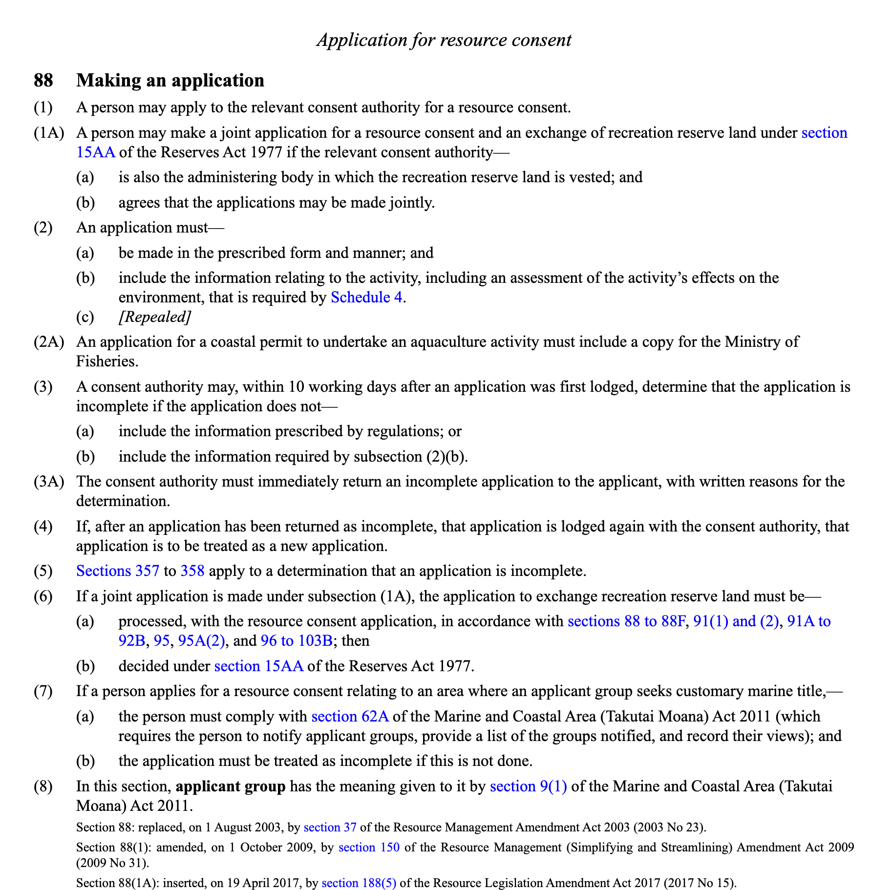
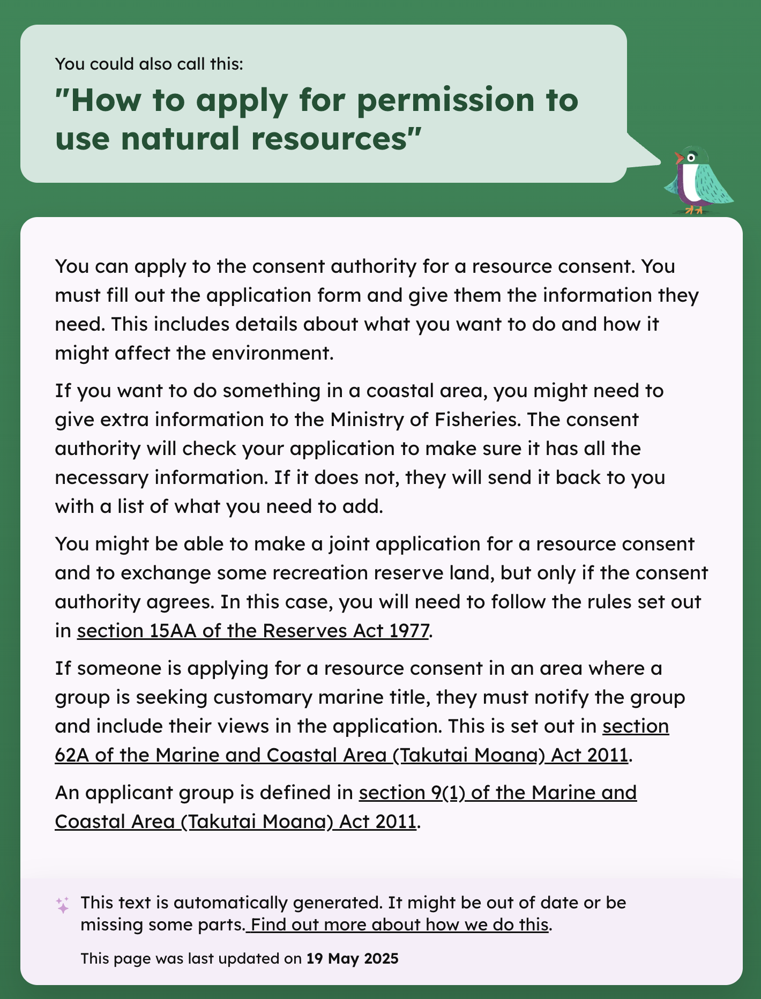
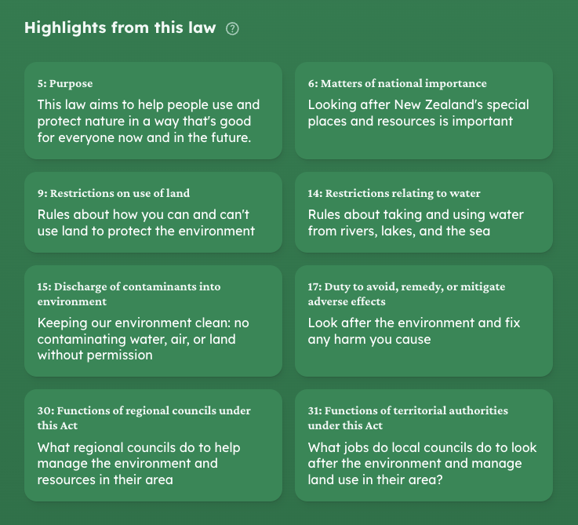
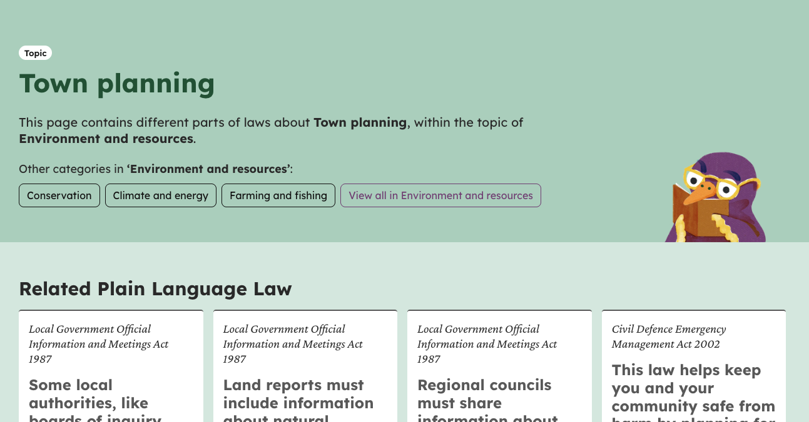
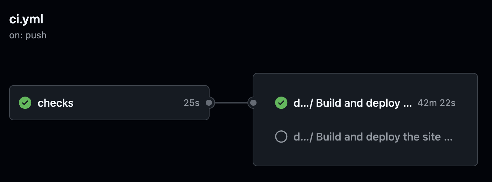
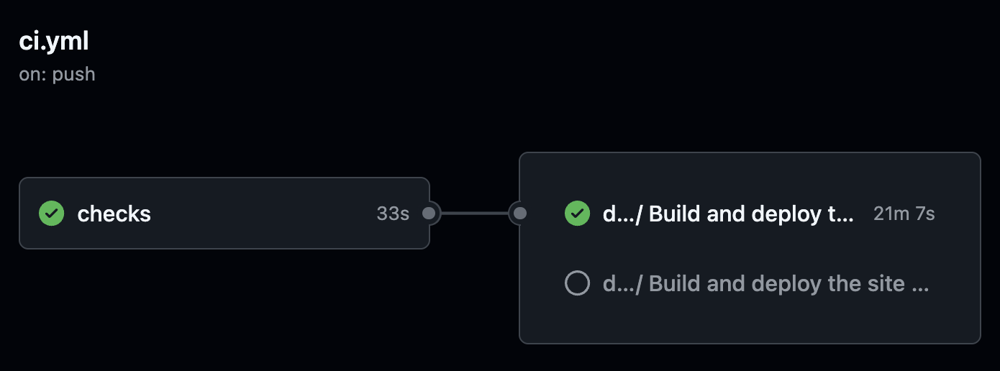
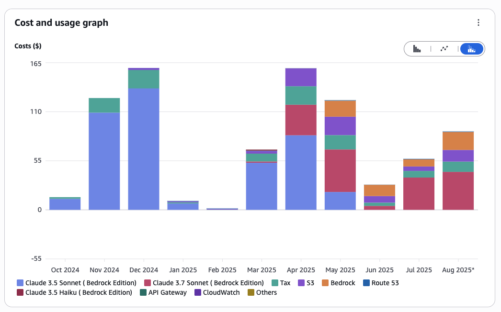

<!--
theme: gaia
style: |
  :root {
    --color-highlight: #e7ff9f;
    --color-background: #194740;
    --color-foreground: #fff;
    --color-dimmed: rgba(255, 255, 255, 0.625);
  }

  .columns {
    display: grid;
    grid-template-columns: repeat(2, minmax(0, 1fr));
    gap: 1rem;
  }

  marp-pre {
    background: var(--color-background);
  }

  marp-pre > code {
    color: var(--color-foreground);
  }

  /* Mermaid diagram theming */
  .mermaid {
    background: var(--color-background);
    padding: 1rem;
  }

  /* Override mermaid default colors to match gaia theme */
  .mermaid .node rect,
  .mermaid .node circle,
  .mermaid .node ellipse,
  .mermaid .node polygon {
    fill: var(--color-highlight);
    stroke-width: 0.25rem;
    stroke: var(--color-highlight);
  }

  .mermaid .flowchart-link {
    stroke: var(--color-highlight) !important;
  }

  .mermaid .marker {
    fill: var(--color-highlight) !important;
  }

  .mermaid .label, .mermaid .nodeLabel {
    color: var(--color-background) !important;
    fill: var(--color-background) !important;
  }
-->

<script type="module">
  import mermaid from 'https://cdn.jsdelivr.net/npm/mermaid@10/dist/mermaid.esm.min.mjs';
  mermaid.initialize({ startOnLoad: true, flowchart: { htmlLabels: true } });
</script>

# Plain Language Law

### Making Legislation Accessible with AI

<br>
<strong>
<small style="opacity: 0.625;">
Josh McArthur<br />
<a href="mailto:josh.mcarthur@ackama.com">josh.mcarthur@ackama.com</a><br />
<a href="https://www.ackama.com">ackama.com</a>
</small>
</strong>

<!--
Speaker Notes:
- Kia ora koutou.
- My name is Josh McArthur.
- Today I'm going to talk about a project called Plain Language Law, where we're using AI to tackle a really interesting problem: making law understandable for everyone.
-->

---

## The Problem

Have you ever tried to read a piece of legislation?



<!--
Speaker Notes:
- Start with a relatable hook. Ask the audience to raise hands.
- It's dense, it's complex, it's intimidating.
- It's written by lawyers, for lawyers. But it affects all of us.
- This complexity isn't just an inconvenience; it's an access to justice issue.
-->

---

## Our Solution: Plain Language Law

A project to make legislative text accessible to everyone using AI, specifically Large Language Models.




<!--
Speaker Notes:
- This is what we built.
- We take that complex source material and, using AI, we translate it into something people can actually understand.
- It's not about "dumbing it down," it's about making it clear.
-->

---

## Why Legislation is a Perfect AI Problem

-   **Lots of text:** There's a good amount of text to work with.
-   **Structured:** Legislation has a predictable, parseable structure (parts/subparts, clauses, provisions)
-   **Value:** Significant social and democratic value of making law accessible.
-   **Complex:** It's a genuinely hard problem with lots of opportunities to enrich content.

<!--
Speaker Notes:
- We didn't just pick this problem at random. It has the perfect set of characteristics for an AI project.
- It's a large-scale data problem, which is where AI shines.
- The structure gives us handholds to work with the data programmatically.
- And the complexity means that simple rule-based systems would fail. It requires the nuance of LLMs.
-->

---

## Our Content Pipeline


<pre class="mermaid" style="text-align: center;">
graph TD
    A(XML Source) --> B(Ingestion);
    B --> C(Content Enrichment);
    C --> D(Build & Deploy);
    D --> E("Publish");
    E -->|Scheduled RSS feed sync| A;
</pre>

<!--
Speaker Notes:
- So, how did we actually build it?
- Here's a high-level view of our pipeline.
- It's a multi-stage process that takes raw XML from the source and ends with a fully built, searchable, and accessible static website.
- I'm going to walk through each of these stages.
-->

---

<div class="columns">

<div>

## Stage 1: Ingestion

-   **Collation:** Parse source XML into a consistent format.
-   **Structuring:** Create YAML frontmatter to hold metadata for each document.
-   **Content:** Convert XML to clean HTML using XSLT.

</div>

<div>

```yaml
---
label: '88'
title: Making an application
full_title: '88: Making an application'
layout: provision
law_context: act
id: DLM233858
act_id: DLM230264
act_title: Resource Management Act 1991
dates:
  as_at: '2025-04-05'
  assent: '1991-07-22'
  first_valid: '2007-09-18'
  year: '1991'
  year_imprint: '2025'
part_id: DLM233845
part_label: '6'
part_title: Resource consents
crosshead_id: DLM233857
crosshead_title: Application for resource consent
---
<html>...</html>
```

</div>
</div>


<!--
Speaker Notes:
- The first stage is the "boring" but critical foundation.
- We use standard, reliable tools like XSLT to transform the legislative XML into clean HTML.
- Crucially, we create a YAML frontmatter block in each file. This acts as a structured data container that our AI processes will populate later.
-->

---

###### Stage 2: AI Content Enrichment:
### Plain Language Generation


```yaml
plain_language_summary: "You can apply to the consent authority for a resource consent.
  \nYou must fill out the application form and give them the information they need.
  ..."
plain_language_metadata:
  usage:
    inputTokens: 4245
    outputTokens: 348
    totalTokens: 4593
  metrics:
    latencyMs: 2241
  model:
    id: us.meta.llama3-3-70b-instruct-v1:0
  timestamp: 1747693222396
  prompt:
    id: ackama.plainlanguageservice.plainlanguage-20250516:v1
plain_language_title: How to apply for permission to use natural resources
```


<!--
Speaker Notes:
- Once we have clean, structured files, we bring in the AI.
- We have several distinct jobs that the LLMs perform.
- The core one is the plain language translation.
- But we also use it for metadata enrichment - extracting key ideas, and classifying the document against our taxonomy.
- All of this AI-generated data is written back into the YAML frontmatter.
-->


---

###### Stage 2: AI Content Enrichment:
### Featured Provision Extraction



```yaml
featured:
- id: DLM231905
- id: DLM231907
- id: DLM231918
- id: DLM231974
- id: DLM231978
- id: DLM232500
- id: DLM232560
- id: DLM232574
```


---

###### Stage 2: AI Content Enrichment:
### Topic Classification

```yaml
topics:
- name: Environment and resources
  categories:
  - name: Town planning
  - name: Conservation
- name: Māori affairs
  categories:
  - name: Māori land
```




<!--
Speaker Notes:
- Once we have clean, structured files, we bring in the AI.
- We have several distinct jobs that the LLMs perform.
- The core one is the plain language translation.
- But we also use it for metadata enrichment - extracting key ideas, and classifying the document against our taxonomy.
- All of this AI-generated data is written back into the YAML frontmatter.
-->


---

## Stage 3: Build & Deploy

-   **Static Site Build:** `Astro` builds the website from the processed HTML files.
-   **Search Index:** `Pagefind` creates a client-side search index.
-   **Automation:** GitHub Actions runs the entire pipeline on a schedule or trigger.
-   **Deployment:** Pushes the final site to `S3` with a `CloudFront` CDN.

<!--
Speaker Notes:
- The final stage is the assembly and deployment.
- We use Astro as our static site generator. I'll talk more about why in a moment.
- We pre-build a search index so the site is fast and searchable on the client side.
- The whole thing is automated with GitHub Actions, which monitors the source for changes and rebuilds the site automatically.
-->

---

## Stage 4: Automate legislation updates
-   RSS Monitoring
-   Pull request workflow
-   mdev environments
-   Labeling workflow

<!--
-   **RSS Monitoring:** GitHub Actions monitors the Legislation site for changes
-   **Pull request workflow:** Updated legislation automatically creates a pull request with the changes.
-   **mdev environments:** We review new legilsation in situ and decide whether to generate plain language or not
-   **Labeling workflow:** We label the legislation with a "generate-plain-language" label if we decide to generate plain language for it, which updates the PR and mdev.

Speaker Notes:
- Automation is an important part of making the project sustainable long-term.
- We've automated the entire process of updating the legislation, from monitoring the source for changes to creating a pull request with the changes.
- We set up mdev environments early on to make it easy for us to review legislation.
- We use labels to trigger different parts of the pipeline, so we can move individual PRs through the process.
-->

---

# Challenges & Lessons Learned

<!--
Speaker Notes:
- Of course, it wasn't all smooth sailing.
- This is often the most interesting part of any project: what went wrong and what we learned.
- I want to cover three main challenges we faced.
-->

---

## Challenge: Static Site Generation


<div class="columns">


<figure>

<figcaption>Jekyll build time: ~30 minutes + 10 minute S3 sync</figcaption>
</figure>


<figure style="margin-top: 25%;">
  
<figcaption>Astro build time: ~10 minutes + 10 minute S3 sync</figcaption>
</figure>

</div>


<!--
Speaker Notes:
- As we added more and more documents, our Jekyll build times exploded.
- We went on a tour of modern SSGs. We were surprised at how many struggled with our dataset, often crashing with out-of-memory errors.
- Astro was the winner. Its island architecture was a good fit, but the key was its flexibility. We could write our own data loading logic to handle the scale, which wasn't as easy in other frameworks.

-   `Jekyll` build times were difficult to work with at scale (>30 minutes).
-   We tried `11ty`, `Next.js`, and `Bridgetown`. Many struggled with the sheer number of files and memory usage.
-   `Astro` was flexible enough to handle it, but required custom file loading logic.
-->

---

## Challenge: LLM Trade-offs

Quality vs. Cost.

-   `Claude`: Excellent results, but expensive at scale.
-   `Llama`: Much cheaper, but required more prompt engineering and fine-tuning to match quality.



<!--
Speaker Notes:
- This is the classic engineering trade-off.
- We started with Claude via an API, and the quality was fantastic out of the box. But the costs were scaling linearly with our content.
- We moved to running Llama on our own. It's drastically cheaper, but it's not a free lunch. We've had to invest a lot more time in prompt engineering and are now looking at fine-tuning to close the quality gap.
-->

---

## Challenge: QA

How do you quality-assure the output of an LLM on sensitive legal text?

-   Manual review is difficult to scale with more content
-   We prototyped multilingual support, but had no way to QA the translations in a sustainable way
-   Detailed QA remains a largely unsolved problem for us

<!--
Speaker Notes:
- This is the hardest problem we face, and I don't have a perfect answer.
- How do we know the AI isn't misinterpreting a critical legal detail?
- We can't have lawyers review thousands of pages a day.
- This has completely blocked some features, like providing translations into languages our team doesn't speak.
- We're exploring solutions like using a second, different LLM as a "reviewer," but it's a major challenge.
-->

---

# Where We're Heading

<!--
Speaker Notes:
- So that's where we are today. But what's next?
- The next major phase of the project is about moving from simple text generation to deeper semantic understanding, and the key to that is embeddings.
-->

---

## Embeddings

-   **The Plan:** Generate vector embeddings for all of our content.
-   This allows us to perform **semantic search** and **conceptual similarity** lookups, not just keyword search.

<!--
Speaker Notes:
- For those who aren't familiar, embeddings are a way of representing text as a series of numbers—a vector—in a high-dimensional space.
- Documents with similar meanings will have vectors that are "close" to each other.
- This unlocks a whole new set of capabilities beyond what we're doing now. I'll give you two examples.
-->

---

###### Embeddings:
#### Use Case 1: Better Summaries with RAG

We can improve Llama's summarization by providing examples of "good" summaries from Claude.

1.  Plain language generation triggered for _X_
2.  Use embeddings to find 3 documents conceptually similar to _X_ that already have good Claude-generated summaries.
3.  Inject those examples into the prompt for Llama
4.  Get a much higher-quality summary from Llama

<!--
Speaker Notes:
- Our Llama model struggles sometimes to create summaries as good as Claude's.
- With embeddings, we can implement a RAG pattern.
- When we want to summarize a new document, we first do a vector search to find a few existing documents that are conceptually similar and that have high-quality summaries we generated with Claude back in the day.
- We then put those examples directly into the prompt for Llama. This "few-shot" prompting dramatically improves the quality of the output.
-->

---

###### Embeddings:
#### Use Case 2: Smarter Content Discovery

Embeddings will power a new generation of features:

-   Automated FAQ Extraction: Find clusters of related provisions and generate Q&A sections.
-   "Related Legislation" Blocks: Go beyond simple keyword links and find other laws that are conceptually related.
-   Building Hierarchies: Automatically group topics and categories into a more intelligent structure.

<!--
Speaker Notes:
- The other big area is content discovery.
- Embeddings will let us build much smarter features.
- We can find clusters of related ideas within the law and automatically generate FAQ sections.
- We can build "related content" features that are far more powerful than what you could do with simple tags or keywords.
- It's really about building a semantic web of legal knowledge.
-->

---

## Key Takeaways

1.  **A solid data pipeline is the foundation of any AI system.** The "boring" tech enables the "smart" tech.
2.  **For us, the trade-offs between cost, quality, and engineering effort are where the real work happens.**

<!--
Speaker Notes:
- So, if you take away three things from this talk, I hope it's these.
- First, don't neglect the data engineering. It's not glamorous, but it's essential.
- Second, be ready to make hard choices about cost vs. quality. There's no magic bullet.
- And finally, if you're working with large text corpora, start thinking about embeddings. It's the key to unlocking the next level of features.
-->

---

# Thank You

**Josh McArthur**

-   Website: plainlanguagelaw.ackama.com / plainlanguagelaw.nz
-   GitHub: github.com/joshmcarthur
-   My website: joshmcarthur.com

**Questions?**

<!--
Speaker Notes:
- That's all I have. Thank you for your time.
- I'd be happy to take any questions.
-->